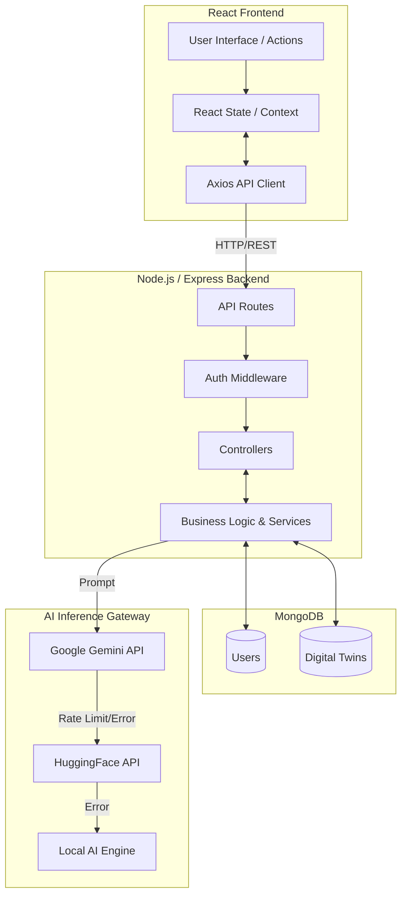
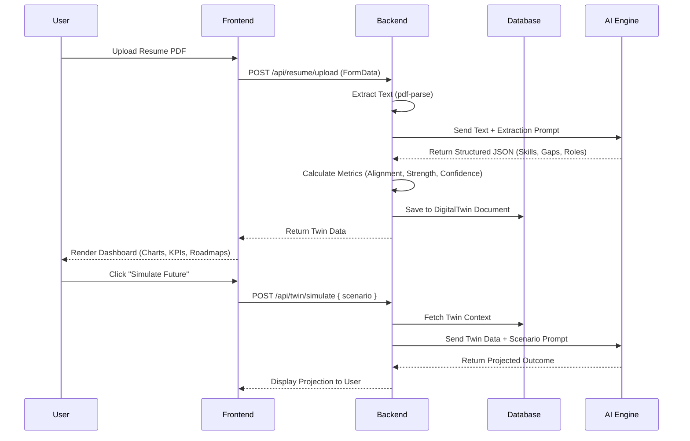
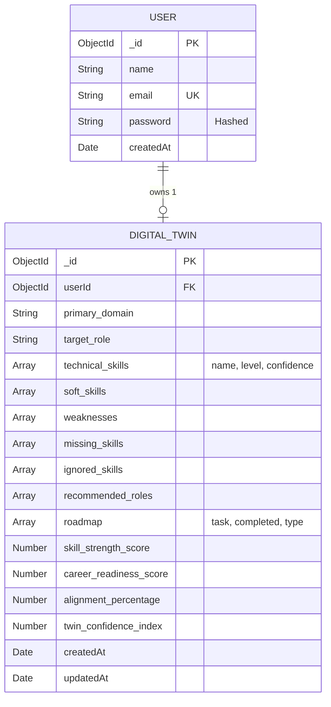

# AI Personal Digital Twin: Smart Career Intelligence Platform
## Official Project Documentation

This document outlines the architecture, data flow, entity relationships, algorithms, and prompt engineering designs for the AI Personal Digital Twin platform.

---

## 1. System Architecture Diagram

The system follows a strict, modular client-server architecture. The frontend is built with React and Vite, while the backend is an Express Node.js application backed by MongoDB. An AI Gateway orchestrates external LLM calls.



---

## 2. Data Flow Diagram (DFD)

This diagram illustrates the flow of data from the moment a user uploads a resume to the generation of the Digital Twin and the subsequent AI mentorship interactions.



---

## 3. Entity Relationship (ER) Diagram

The database is heavily optimized around the user and their associated Digital Twin.



---

## 4. Core Algorithm Explanations

### 4.1. Skill Strength Score
Determines the absolute power of the user's technical stack mapping.
* **Level Weights:** Beginner = 1.0, Intermediate = 2.0, Advanced = 3.0
* **Formula:** `Σ (Weight * Confidence Score) / Total Skills`
* **Implementation:** `analyticsService.calculateSkillStrength(skills)` normalizes the score to a 0-100 scale, taking into account the number of active skills.

### 4.2. Career Alignment Engine
Evaluates how closely the user's current active skills match their chosen `target_role` (e.g., "Senior Software Engineer").
* **Mechanism:** The system maintains an offline dictionary/dataset of standard industry roles and their required baseline skills.
* **Formula:** `(Overlapping Active Skills / Total Required Skills For Role) * 100` (capped at 100%).
* **Implementation:** The backend compares the normalized strings of the user's `technical_skills` arrays against the required arrays.

### 4.3. Digital Twin Confidence Index
A meta-score indicating how much the system trusts its own predictions based on data richness.
* **Data Richness:** Based on the raw length of the extracted resume text and number of fields populated.
* **Skill Coverage:** Based on the raw count of `technical_skills` + `soft_skills`.
* **Activity Level:** Based on the number of completed items in the `roadmap` and active UI interactions.
* **Formula:** `(DataRichness(max 33) + SkillCoverage(max 33) + ActivityLevel(max 34)) = Total %`

---

## 5. Prompt Engineering Design

The system relies on heavily structured prompts to enforce pure JSON outputs and guide the AI's persona.

### 5.1. Intelligence Extraction Prompt (Zero-Shot JSON Enforcer)
```text
"You are an AI Career Intelligence Engine. Your task is to analyze the following resume text and extract career intelligence. 
You MUST return ONLY a valid, raw JSON object. Do not use markdown blocks, backticks, or conversational text. 
Follow this exact schema:
{
  "technical_skills": [ { "name": "string", "level": "Beginner|Intermediate|Advanced", "confidence": number 0-100 } ],
  "soft_skills": ["string"],
  "primary_domain": "string",
  "recommended_roles": ["string", "string"],
  "strengths": ["string"],
  "weaknesses": ["string"],
  "missing_skills": ["string"]
}
Resume Text: [INSERT_TEXT]"
```

### 5.2. AI Mentor Prompt (Context-Aware Persona)
```text
"You are an elite Tech Career Coach. Your client has the following Digital Twin snapshot:
Target Role: {twin.target_role}
Current Skills: {twin.technical_skills}
Missing/Weaknesses: {twin.weaknesses}
Overall Readiness: {twin.career_readiness_score}%

The user asks: '{user_message}'

Provide actionable, concise, and highly encouraging advice. Keep responses under 4 short paragraphs. Highlight specific skills from their weaknesses if relevant."
```

### 5.3. Future Scenario Simulator Prompt
```text
"You are a predictive Career Path AI. The user's current primary domain is {twin.primary_domain}. 
They want to simulate a future decision: '{scenario}'.
Using their active skills ({active_skills}) and their current readiness ({readiness}%), project a realistic 6-month outcome of this decision. Output a highly professional, calculated, 3-sentence predictive analysis."
```

---

## 6. Future Scope

While the platform is currently production-ready, subsequent iterations for scaling the startup could include:
1. **Live Job Board Integration:** Connect to LinkedIn or Indeed APIs to match `target_roles` and `missing_skills` to real-time job openings in the user's geographical area.
2. **GitHub/GitLab Telemetry:** Automatically sync GitHub commit history to dynamically raise or lower the `Confidence Score` of specific `technical_skills`.
3. **Multi-Tenant Org Accounts:** Allow universities or coding bootcamps to have administrative dashboards to monitor the aggregate `career_readiness_score` of their entire student cohort.
4. **Automated MLOps Pipeline:** Phase out external third-party APIs (Gemini/OpenAI) entirely in favor of fine-tuned locally hosted LLaMA 3 models specifically trained on tech resumes.
