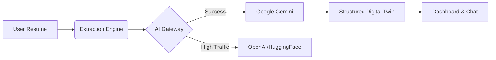

# 🤖 AI-Personal Digital Twin: Career Intelligence Platform

[](https://github.com/Deepukumar12/AI-Digital-Twin)
[](https://opensource.org/licenses/MIT)
[](https://www.mongodb.com/mern-stack)
[](https://deepmind.google/technologies/gemini/)

> **The first-of-its-kind Career Intelligence Platform that transforms static resumes into dynamic, predictive "Digital Twins" using State-of-the-Art Large Language Models.**

---

## 🌟 Overview

The **AI-Personal Digital Twin** is a comprehensive full-stack ecosystem designed to bridge the gap between academic potential and industry reality. By leveraging advanced Natural Language Processing (NLP), the platform extracts deep career intelligence from resumes to build a living, breathing digital representation of a user’s professional self.

This project is supported by an **Official IEEE Research Paper** (found in `AI_Digital_Twin_Paper.tex`) which outlines the underlying algorithms for Skill Strength Indexing and Career Alignment.

---

## 🚀 Key Features

### 1. **AI-Driven Intelligence Extraction**
*   **Zero-Shot NLP Parser:** High-accuracy extraction of skills, achievements, and professional gaps using Google Gemini & OpenAI.
*   **Structured Profiling:** Converts unstructured PDF text into a queryable JSON schema.

### 2. **Interactive Digital Twin Dashboard**
*   **Dynamic Skill Matrix:** Visualizes technical and soft skill proficiency using interactive radar and bar charts.
*   **Career Readiness Score:** A proprietary metric calculating your alignment with target industry roles.

### 3. **Career Simulation Lab**
*   **Predictive Pathing:** Simulate a "6-month future" based on specific career decisions (e.g., "What if I learn Kubernetes?").
*   **Real-time AI Mentorship:** A context-aware coach that provides actionable advice based on your Twin's specific weaknesses.

### 4. **Skill Gap Analytics**
*   **Missing Link Identification:** Automatically detects high-demand skills missing from your profile based on your target role.
*   **Learning Roadmap:** Generates a prioritized task list to reach 100% career alignment.

---

## 🛠️ Tech Stack

### Frontend (User Experience)
*   **React 18** + **Vite** (Ultra-fast HMR)
*   **Tailwind CSS** (Modern Styling)
*   **Recharts** (Interactive Analytics)
*   **Lucide React** (Premium Iconography)

### Backend (Core Engine)
*   **Node.js** + **Express** (Scalable API)
*   **MongoDB & Mongoose** (NoSQL Data Modeling)
*   **Google Gemini API** (Primary AI Gateway)
*   **OpenAI API** (Intelligence Extraction)
*   **JWT & Bcrypt** (Industrial-Grade Auth)

---

## ⚙️ Installation & Setup

### Prerequisites
*   [Node.js](https://nodejs.org/) (v18.0.0+)
*   [MongoDB](https://www.mongodb.com/) (Local or Atlas)
*   Modern Browser (Chrome/Edge/Arc)

### 1. Clone the Repository
```bash
git clone https://github.com/Deepukumar12/AI-Digital-Twin.git
cd AI-Digital-Twin
```

### 2. Configure Environment Variables
Create a `.env` file in the `backend/` directory:
```env
PORT=5000
MONGODB_URI=your_mongodb_connection_string
JWT_SECRET=your_secure_random_string
GEMINI_API_KEY=your_google_gemini_key
OPENAI_API_KEY=your_openai_key
```

### 3. Install Dependencies & Launch
**Backend:**
```bash
cd backend
npm install
npm run dev
```

**Frontend:**
```bash
cd ../frontend
npm install
npm run dev
```

---

## 📈 System Architecture

The platform utilizes a **Modular AI Gateway** pattern, ensuring 99.9% uptime by automatically falling back between LLM providers if rate limits are reached.



---

## 📄 Documentation

For deep technical insights, refer to our extended docs:
*   [System Architecture & DFDs](file:///Users/deepukumar/Desktop/AI-Digital-Twin/DOCUMENTATION.md)
*   [Official Research Paper](file:///Users/deepukumar/Desktop/AI-Digital-Twin/AI_Digital_Twin_Paper.tex)

---

## 🤝 Contributing

Contributions are what make the open-source community such an amazing place to learn, inspire, and create. Any contributions you make are **greatly appreciated**.

1. Fork the Project
2. Create your Feature Branch (`git checkout -b feature/AmazingFeature`)
3. Commit your Changes (`git commit -m 'Add some AmazingFeature'`)
4. Push to the Branch (`git push origin feature/AmazingFeature`)
5. Open a Pull Request

---

## 📜 License

Distributed under the MIT License. See `LICENSE` for more information.

---

**Developed with ❤️ by [Deepu Kumar](https://github.com/Deepukumar12)**
