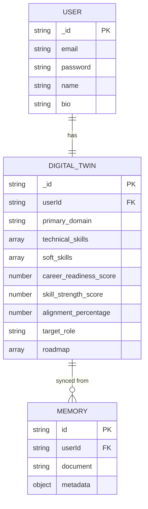

# Data Flow & ER Diagram
## Schema Architecture (Master Spec)

### Entity Relationship Model

### Intelligence Data Flow
1. **Input**: User uploads PDF.
2. **Parsing**: `pdf-parse` extracts raw text.
3. **Extraction**: AI Gateway invokes Groq (Llama-3) to structure text into `DigitalTwin` schema.
4. **Memory Injection**: Raw resume and extracted profile stored in ChromaDB.
5. **Real-time Scoring**: `analyticsService` calculates current readiness and alignment.
6. **Market Sync**: `marketService` pulls Remotive trends for the extracted domain.
7. **Simulation**: User interacts with Copilot to test hypothetical career scenarios (AI generated).
