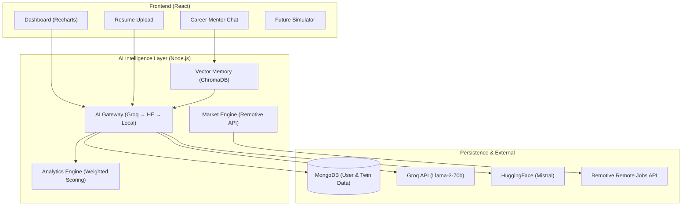

# System Architecture: AI Personal Digital Twin
## Career Intelligence Platform (Master Spec v1.0)

This document describes the high-level architecture and data flow for the production-ready AI Digital Twin system.

### Core Components
1. **Dynamic Dashboard**: Responsive UI with real-time charting using Recharts.
2. **AI Gateway**: Multi-provider fallback orchestration (Groq primary, HuggingFace fallback).
3. **Vector Memory**: Long-term context storage using ChromaDB for semantic chat retrieval.
4. **Market Engine**: Real-time correlation with Remotive's job market data.
5. **Weighted Analytics**: Custom scoring algorithms for Skill Strength and Career Alignment.
